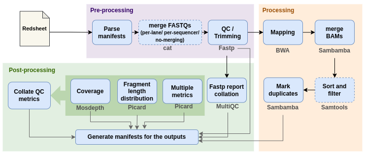

# Early Cancer Detection Pipeline
## Introduction

The pipeline is built using [Nextflow](https://www.nextflow.io/) (DSL2). It runs in conda environments, which should be activated before the launch of the pipeline. All the processes in the pipeline are defined as separate module scripts. These scripts can also be included and shared across other workflows.

## Pipeline Summary


Pipeline accepts a redsheet as input. The pipeline is only triggered for WGS samples in the given redsheet.
The FASTQ file information can be read either from the manifest files or directly from a directory.

> Note that this might change in future. Pipeline will be launched automatically for incoming redsheets.

## Quick start
1. Install dependencies.
    ```console
    cd environments
    ./setup.sh
    ```
    The script creates the environments using `yml` files. Internet access is required.
2. In the run script, export the paths to conda environments (provided by `setup.sh`). If you are running the pipeline on REDCAP HPC system or SC1, environments are already available. 
    - **REDCAP HPC system**:
        ```console
        export PATH="/scratchfsx/early_cancer_detection/environment/python3_env/bin:$PATH"
        export PATH="/scratchfsx/early_cancer_detection/environment/nxf_env/bin:$PATH"
        ```
    - **SC1 cluster**:
        ```console
        export PATH="/sc1/groups/bfx-red/projects/neusomatic/strand/benchmarking/earlycancer/environment/early-cancer-detection/bin:$PATH"
        export PATH="/sc1/groups/bfx-red/projects/neusomatic/strand/benchmarking/earlycancer/environment/python3/bin:$PATH"
        ```

    > When using a compute cluster make sure to provide a shared file system path accessible from all compute nodes.
3. Test the pipeline on minimal dataset.

    i. Add following lines in the run script:
    ```console
    nextflow run main.nf \
    --redsheet $PWD/test_files/test_redsheet.csv \
    --manifestdir $PWD/test_files \
    --reference $PWD/test_files chr22_bwa_index/chr22.fa \
    --outdir results \
    --merge_FASTQs per-lane \
    --profile <cloudcluster/sc1cluster>
    ```
    ii. Run the script:
    ```console
    bash <script_name>.sh
    ```
4. Start running your analysis!
    ```console
    #!/bin/bash

    # ---- REDCAP HPC ---- #

    export PATH="/scratchfsx/early_cancer_detection/environment/python3_env/bin:$PATH"
    export PATH="/scratchfsx/early_cancer_detection/environment/nxf_env/bin:$PATH"

    nextflow run main.nf \
    --redsheet <redsheet> \
    --manifestdir <dirname> \
    --reference <fa file> \
    --outdir <outdir> \
    --merge_FASTQs <per-lane,per-sequencer or false> \
    --profile cloudcluster
    ```

## Documentation

## Usage

### **REDsheet input**
Pipeline requires redsheet as input. Use this parameter to specify its location. It has to be a comma-separated file with 51 columns, and the header row is expected to be at row 8. Sample names are collected from the column `name_alias`. Samples with `analysis_type` as 'Whole Genome Genomic' are identified and pipeline is triggered only for these samples. Only one redsheet can be specified at a time.
```
--redsheet [path to redsheet]
```
In addition to redsheet's location, information about FASTQ files is also required. You can either specify the path to directory containing manifests or specify the path to directory containing the FASTQs.
```
# useful for running on REDCAP HPC
--manifestdir [path to directory containing manifests] 

# --------  OR  --------  #

# useful for running on SC1 cluster
--sampledir [path to directory containing FASTQs]
```
> Directory speicifed to `--sampledir` is expected to have sub-directories i.e., one for each flowcell in the redsheet.

### **FASTQ file merging options**
For each sample, total of 20 FASTQ pairs are expected (5 flowcells * 4 lanes). Pipeline provides 2 ways to merge these files, all lanes per sequencer and all sequencers per lane. See diagram [here](docs/FASTQ_merging_approaches.jpg) for more information. Use this parameter to specify the merging approach.
```console
--merge_FASTQs [per-lane, per-sequencer or false (for no-merging)]
```
> On REDCAP HPC system, `per-lane` approach is recommended.

### **Reference genome**
The `--reference` parameter accepts the location of the reference genome FASTA. It has to be indexed (BWA index)  and all the index related files are expected at the same path as the FASTA file.

### **Core nextflow arguments**
- #### `-profile`
    Use this parameter to choose a configuration profile. Currently, there are three profiles that are supported:
    - local - run on your local machine
    - cloudcluster - run on REDCAP HPC system (slurm)
    - sc1cluster - run on SC1 (UGE)

- #### `-resume`
    Specify this when restarting a pipeline. Nextflow will use cached results from any pipeline steps where the inputs are the same, continuing from the last completed step. For input to be considered the same, not only the names must be identical but the files' contents as well.

- #### `-c`
    Specify the path to a specific config file.

### **Custom configuration**
**Resource request:**
The default values are set as per the results of benchmarking experiments on HPC with per-lane setup. You may want to customise the compute resources that the pipeline requests. This can be done in following way:
1. Identify the process to change the resources for. You can also see [this](configs/resources.config) config file for reference.
2. Create a custom config like the example mentioned below and provide to the pipeline via the `-c` parameter .
    ```console
    process {
        withName:bwamem {
            cpus = 20
            memory = 16G
        }
    }
    ```

### **Running Nextflow in background**
The Nextflow process must run until the pipeline is finished. You can use `-bg` option to launch _Nextflow_ in the background, so that the workflow does not stop if you log out of your session. Alternatively, you can also use `screen`.  

<br>

## Parameters
### **Input/output options**
|  |  |
| -------------------- | ----------- |
| `--redsheet`      | Path to the redsheet|
| `--manifestdir`      | Path to the directory containing manifest files for samples in the `--redsheet`|
| `--sampledir`      | Path to the directory containing FASTQ files for samples in the `--redsheet`. This is helpful when pipeline is ran on SC1|
| `--outdir`           | Path to the output directory where the results will be saved.|
| `--tracedir`         | Path to the directory where execution reports will be saved. [ `<outdir>/pipeline_info` ]|

### **Reference genome options**
|  |  |
| ------------ | ----------- |
| `--reference`| Path to reference FASTA file. BWA index should also be present at this path|

### **FASTQ files merging options**
|  |  |
| ------------ | ----------- |
| `--merge_FASTQs`|  Choose from `per-lane`, `per-sequencer` and `false` (no-merging). For more info these merging strategies, see [here](docs/FASTQ_merging_approaches.jpg) |


### **Quality filtering and trimming options**
|  |  |
| ------------------- | ----------- |
| `--fastp_threads`             | Number of threads to pass to fastp [ `8` ]|
| `--cut_window_size`           | **per read cutting by quality option**: the window size. Range: 1~1000. [ `5` ] |
| `--qualified_quality_phred`   | **quality filtering option**: the quality value that a base is qualified for. Default is 20 means phred quality >=Q20 is qualified. [ `20` ] |
| `--length_required`           | **length filtering option**: Reads shorter than length_required will be discarded [ `50` ] |
> NOTE: In addition to these parameters, following parameters are provided while running the fastp command: `--detect_adapter_for_pe`, `--trim_poly_x`, `--trim_poly_g`, `--cut_tail`.

### **Alignment options**
|  |  |
| ------------ | ----------- |
| `--bwamem_threads`| Number of threads to pass to BWA [ `8` ] |

### **BAM files merging options**
|  |  |
| ------------ | ----------- |
| `--sambamba_merge_threads`| Number of threads to pass to `sambamba merge` [ `28` ] |

### **Filtering options for mapped BAM files**
|  |  |
| ------------ | ----------- |
| `--skip_filter`  | Whether to skip filter step or not [ `true` ] |
| `--samtools_filter_threads`| Number of threads to pass to `samtools view` [ `10` ]|
| `--exclude_flags`| Samtools-flags to exclude [ `4` ]|
| `--require_flags`| Samtools-flags to include [ `false` ]|
| `--min_MQ`       | Skip alignments with MAPQ smaller than [ `30` ]|


### **Duplicates marking options**
|  |  |
| ------------ | ----------- |
| `--sambamba_threads`  | Number of threads to pass to Sambamba markdup [ `28` ]|
| `--overflow_list_size`| Size of the overflow list where reads, thrown away from the hash table, get a second chance to meet their pairs); increasing the size reduces the number of temporary files created. [ `2000000` ] |
| `--remove_duplicates` | Remove duplicates instead of just marking them [ `false` ]|
| `--tmpdir`            | Path to tmp directory [ `'/rawfsx/early_cancer_test_runs/tmp'` ] |

### **Coverage calculation options**
|  |  |
| ------------ | ----------- |
| `--mosdepth_threads`| Number of threads to pass to mosdepth [ `10` ]|
| `--flag`            | Samtools-flags to exclude [ `3840` ]|
| `--include_flag`    | Samtools-flags to include [ `2` ]|

### **Fragment length distribution options**

Fragment length distribution is calculated by _Picard CollectInsertSizeMetrics_. There are no configurable options available for this step.
> NOTE:  `-VALIDATION_STRINGENCY SILENT` is provided while running the command.

### **Whole genome mapping metrics options**
|  |  |
| ------------ | ----------- |
| `--MULTI_METRICS_PROGRAMS`| Modules to pass to Picard CollectMultipleMetrics [ `CollectAlignmentSummaryMetrics,QualityScoreDistribution,CollectGcBiasMetrics` ] |
> NOTE:  `-VALIDATION_STRINGENCY SILENT` is provided while running the command.

**Advanced Parameters**

Advanced options like changing the directory for results from a specific step, passing additional parameters to a specific tool etc. can be configured from the `configs/modules.config` file.

Users will not be able to configure these parameters from the command line directly. Modifying these parameters from the configuration file requires some knowledge of _Nextflow_.

<br>

## Results

| Directory | Output by | Files | Description |
| --------- | --------- | ----- | ----------- |
| `01_QC_reports`| `fastp`, `mosdepth` and `picard` | fastp: json <br> mosdepth: txt <br> picard_CollectInsertSizeMetrics: txt <br> picard_CollectMultipleMetrics: txt | QC reports from different tools |
| `01_QC_reports/batch_qc`| Jupyter Notebook for QC collation | HTML, xlsx | collated QC reports from different tools for samples processed from the redsheet |
| `02_dups_marked_reads`| `Sambamba markdup` | bam, bai | Duplicates marked reads |
| `pipeline_info`| `Nextflow` | HTML, txt | Execution reports |

